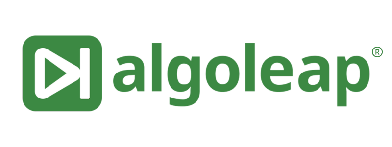

<div align="center">
  
  <h1>Algoleap Corporate Website</h1>
  <p><strong>Next-Generation Digital Product Engineering and AI Co-creation</strong></p>

  [](#)
  [](#)
  [](#)

</div>

<br />

> **Algoleap** is a specialized consulting firm providing cutting-edge Digital Product Engineering, Service Management, and AI solutions. This repository houses the statically generated corporate website.

---

## 🌟 Visual Showcase

<div align="center">
  
  
</div>

<br />

## 🏗️ Architecture & Stack

The site is built with a strict focus on maximum performance, SEO, and maintainability, bypassing the overhead of heavy SPA frameworks:
- **Core:** Pure HTML5 and CSS3 (A completely bespoke design system—no external bloated libraries).
- **Interactivity:** Vanilla JavaScript for lightning-fast DOM manipulation.
- **Data Management:** Dynamic client-side JSON fetching for Insights and Success Stories, keeping content strictly decoupled from structure.
- **Styling:** CSS Custom Properties architecture anchored around the brand identity (Brand Green: `#48a562`).

<br />

## 📁 Directory Structure

```text
/
├── assets/                  # Brand logos, icons, and page-specific media
├── data/                    # JSON data files (insights.json)
├── docs/                    # Developer documentation & handover guides
├── styles.css               # Global CSS styling and bespoke grid systems
├── success-stories-data.json# Content API for all dynamic case studies
├── index.html               # Application Entry point
└── *.html                   # Optimized static pages
```

<br />

## 🚀 Quick Start (Local Development)

Because the site securely fetches data from local JSON files, you must run it through a local web server (opening the files directly via `file://` will cause browser CORS errors).

1. **Clone the repository:**
   ```bash
   git clone https://github.com/algoleap-demo/algoleap.git
   cd algoleap
   ```

2. **Serve locally:**
   *Using Python (Recommended):*
   ```bash
   python -m http.server 8000
   ```
   *Or using Node.js:*
   ```bash
   npx serve .
   ```

3. **View the site:** Open `http://localhost:8000` in your web browser.

<br />

## 📝 Content Management

To update **Success Stories** or **Insights**, you do **not** need to touch the HTML files. 

Simply edit the corresponding JSON files (`success-stories-data.json` or `data/insights.json`). The dynamic routing templates (e.g., `success-story-detail.html?slug=...`) will automatically fetch, map, and render the new content seamlessly.

---

<div align="center">
  <p>Built with precision by the <strong>Algoleap Engineering Team</strong>.</p>
</div>
